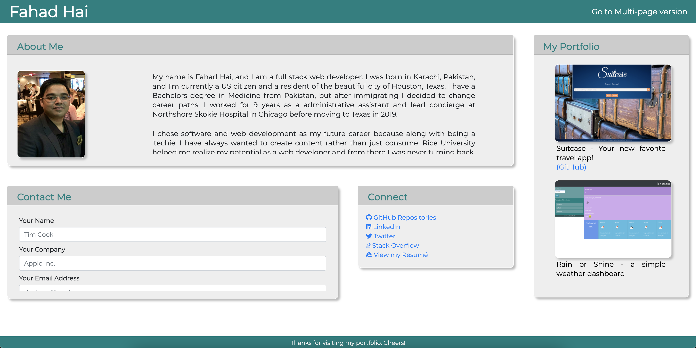
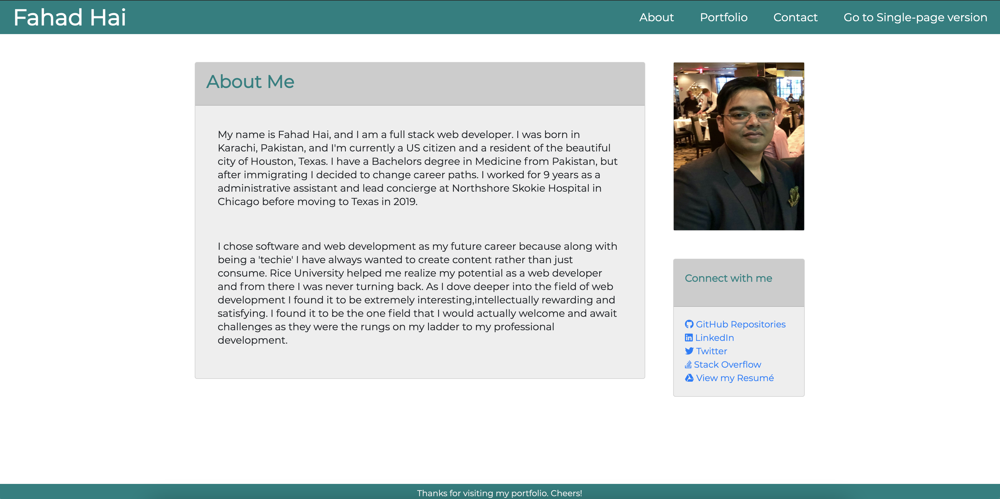

[![Contributors][contributors-shield]][contributors-url]
[![Forks][forks-shield]][forks-url]
[![Stargazers][stars-shield]][stars-url]
[![Issues][issues-shield]][issues-url]
[![MIT License][license-shield]][license-url]
[![LinkedIn][linkedin-shield]][linkedin-url]

 

  

  <h3 align="center">My Portfolio</h3>

  

    A portfolio for my work
     
    <a href="https://github.com/wdfhai/portfolio-live"><strong>Explore the docs »</strong></a>
    .
    <a href="https://wdfhai.github.io/portfolio-live/">View Demo</a>
  

  
Table of Contents

  <ol>
    <li>
      <a href="#about-the-project">About The Project</a>
      <ul>
        <li><a href="#built-with">Built With</a></li>
      </ul>
    </li>
    <li>
      <a href="#getting-started">Getting Started</a>
      <ul>
        <li><a href="#prerequisites">Prerequisites</a></li>
        <li><a href="#installation">Installation</a></li>
      </ul>
    </li>
    <li><a href="#usage">Usage</a></li>
    <li><a href="#roadmap">Roadmap</a></li>
    <li><a href="#contributing">Contributing</a></li>
    <li><a href="#license">License</a></li>
    <li><a href="#contact">Contact</a></li>
    <li><a href="#acknowledgements">Acknowledgements</a></li>
  </ol>

## About The Project

[![Product Name Screen Shot][product-screenshot]](.images/portfolio-aio-preview.png)

A portfolio is like a digital handshake. The first time you interact with it, you can instantly infer certain qualities about the owner. The first impression may not be the last impression, but it is certainly the most important one. I started designing this portfolio after going through HTML/CSS for 10 hrs, and it has since evolved along with my knowledge of coding, and it will continue to do so throughout my career.

Some elements I considered highly for my portfolio were:

- a clean and modern UI,
- an intuitive design with well-implemented features,
- code that is as DRY as possible, which is easier said than done :smile:

A list of commonly used resources that I find helpful are listed in the acknowledgements.

### Built With

- [Bootstrap](https://getbootstrap.com)

## Getting Started

Check out the 'View Demo' link above. Try both the single and multi-page versions.

## Usage

The portfolio can be viewed as an all-in-one (or AIO) or a multi-page version.

 

 

## Roadmap

Like any great portfolio, this one is designed to scale with my career while required minimum refactoring as future projects get added.

## Contributors/ Teammates

- Contributors to individual projects are listed under that project.

## Contributing

Contributions are what make the open source community such an amazing place to be learn, inspire, and create. Any contributions you make are **greatly appreciated**.

1. Fork the Project
2. Create your Feature Branch (`git checkout -b feature/AmazingFeature`)
3. Commit your Changes (`git commit -m 'Add some AmazingFeature'`)
4. Push to the Branch (`git push origin feature/AmazingFeature`)
5. Open a Pull Request

## License

Distributed under the MIT License. See `LICENSE` for more information.

## Contact

Fahad Hai - [@wdfhai](https://twitter.com/wdfhai) - wd.fhai@outlook.com

My Github: [wdfhai](https://github.com/wdfhai)

## Acknowledgements

[contributors-shield]: https://img.shields.io/github/contributors/othneildrew/Best-README-Template.svg?style=for-the-badge
[contributors-url]: https://github.com/othneildrew/Best-README-Template/graphs/contributors
[forks-shield]: https://img.shields.io/github/forks/othneildrew/Best-README-Template.svg?style=for-the-badge
[forks-url]: https://github.com/othneildrew/Best-README-Template/network/members
[stars-shield]: https://img.shields.io/github/stars/othneildrew/Best-README-Template.svg?style=for-the-badge
[stars-url]: https://github.com/othneildrew/Best-README-Template/stargazers
[issues-shield]: https://img.shields.io/github/issues/othneildrew/Best-README-Template.svg?style=for-the-badge
[issues-url]: https://github.com/othneildrew/Best-README-Template/issues
[license-shield]: https://img.shields.io/github/license/othneildrew/Best-README-Template.svg?style=for-the-badge
[license-url]: https://github.com/othneildrew/Best-README-Template/blob/master/LICENSE.txt
[linkedin-shield]: https://img.shields.io/badge/-LinkedIn-black.svg?style=for-the-badge&logo=linkedin&colorB=555
[linkedin-url]: https://linkedin.com/in/othneildrew
[product-screenshot]: images/portfolio-aio-preview.png

### Credit

- This template was inspired by and modified from the template designed by othneildrew. Connect with him at :

* Github: https://github.com/othneildrew/
* Github Repo: https://github.com/othneildrew/Best-README-Template
